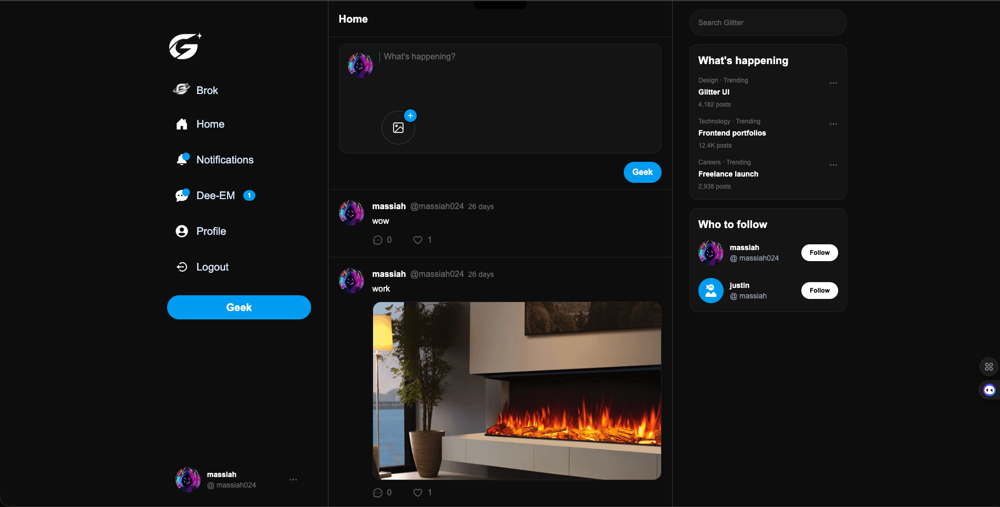
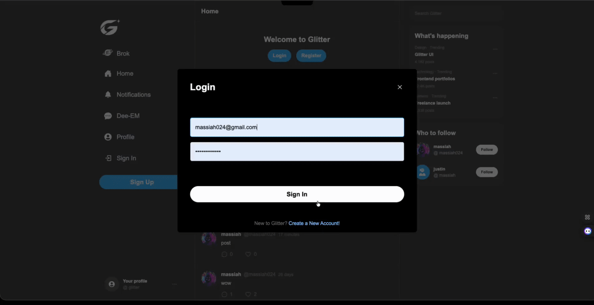
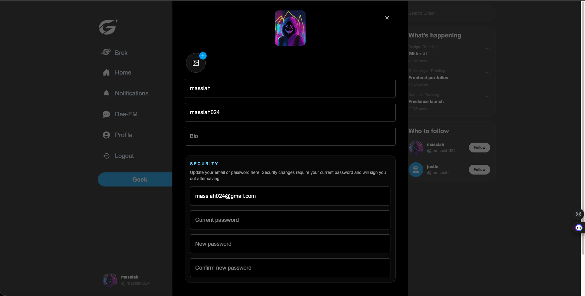
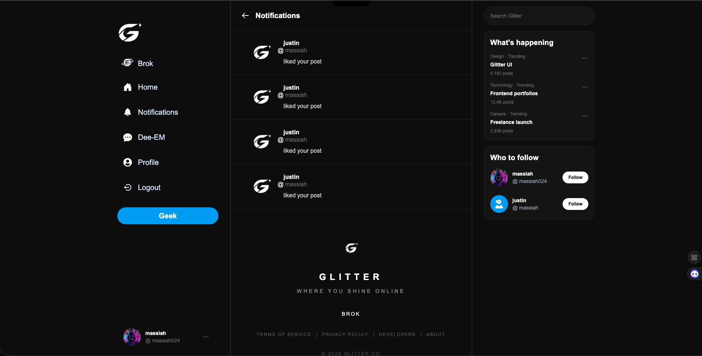
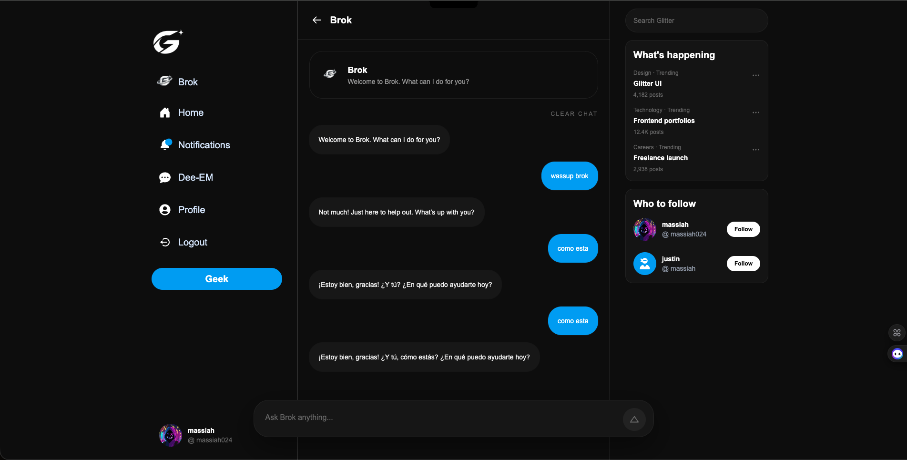
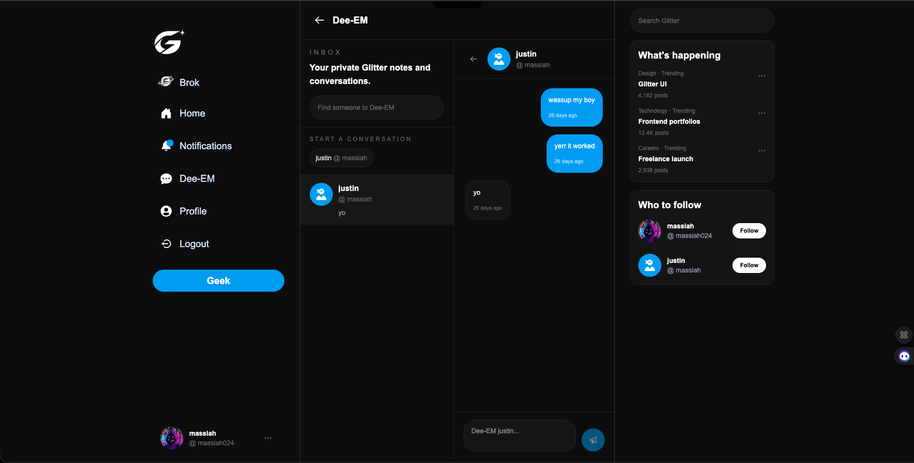

# Glitter

Glitter is a full-stack social platform built from a familiar Twitter-style foundation into a more distinct, account-aware product with its own branding, interaction flow, and social identity.

The app combines dynamic profiles, posting, follows, likes, notifications, private messaging, and AI-assisted interaction through Brok into one connected social system. A large part of the project focused on keeping account state, profile ownership, modal behavior, messaging, and interaction flow feeling cohesive across the entire app instead of letting features drift into disconnected experiences.

The product structure is built around social state and user context. The UI changes depending on whether someone is signed out, viewing their own account, visiting another profile, opening edit flows, following users, liking posts, or moving through Dee-EM conversations. Keeping those states synchronized consistently across the app became one of the main engineering challenges in the project.

The frontend was built with Next.js, React, TypeScript, Tailwind, Zustand, SWR, and React Query, with Prisma, MongoDB, and NextAuth supporting the backend and authentication layer. Zustand was used intentionally for lightweight UI state like modals and interaction flow instead of introducing heavier global state architecture where the product scope did not need it.

## Live Demo

[https://glitter-theta.vercel.app](https://glitter-theta.vercel.app)

## Core Features

- Account-aware UI across guests, profile owners, and signed-in users
- Dynamic profile pages with follow state, social metrics, and ownership-aware actions
- Post creation with text, image support, comments, likes, and notifications
- Dee-EM private messaging with thread views, unread counts, optimistic sends, and read-state syncing
- Brok AI chat with dedicated routing, suggested prompts, image-capable replies, and local history persistence
- Modal-driven profile editing and security flow with protected account updates
- Responsive social layout with branded interaction patterns and custom product terminology
- Lightweight optimistic UI patterns using Zustand, SWR, and React Query for smoother interaction flow

## Project Preview

The screens below show the parts that pushed Glitter past tutorial energy: the feed, the edit profile flow, notifications, Brok, and Dee-EM.



The main walkthrough below shows the branded login flow, loading state, and the more interactive side of the product like optimistic updates, messaging, and social feedback loops.



## Architecture Snapshot

Frontend:
- Next.js 16 Pages Router
- React 19
- TypeScript
- Tailwind CSS 4

Backend and Data:
- NextAuth
- Prisma ORM
- MongoDB
- Next.js API routes under `pages/api`

State and UX:
- Zustand for modal and interaction state
- SWR and React Query for client data flow
- React Hot Toast for inline feedback
- Optimistic UI patterns in posting and messaging flows

## Demo Accounts

### Primary Demo Account

- Email: `massiah024@gmail.com`
- Password: `random123!321`
- Best for testing the fuller feed, profile, and account-owner flows

### Secondary Demo Account

- Email: `justin.henry0024@gmail.com`
- Password: `random123!321`
- Best for testing follow state, notifications, profile switching, and Dee-EM conversations between two users

## Account Systems and Social State

A major focus of Glitter was making social state feel connected across the app instead of isolated to individual screens.

That included:
- ownership-aware profile behavior
- protected posting and messaging actions
- follow and notification synchronization
- modal and sidebar interaction flow
- unread messaging state
- conditional route and account behavior

A lot of the engineering complexity came from making those systems consistently surface the right controls and interaction states depending on who the current user was and where they were navigating from.

## Dee-EM and Brok

Two of the stronger product extensions inside Glitter are Dee-EM and Brok.

Dee-EM handles the one-to-one side of the platform through:
- searchable conversations
- thread-based messaging
- profile-launched conversations
- unread counts
- optimistic message updates
- read-state syncing

Brok extends the product with a branded AI interaction layer that includes:
- dedicated chat routing
- prompt handling
- local history persistence
- image-capable responses
- suggested prompts

Both systems helped push the app beyond a standard social feed structure and gave the product a stronger internal identity.

## Feature Screens

### Profile Editing and Security Flow



### Notifications View



### Brok Chat Surface



### Dee-EM Messaging



## What I Built

### 1. Account-Aware Social App Behavior

I built Glitter around real user state instead of treating auth like a decorative layer.

That includes:

- modal-based sign up and sign in
- protected actions for posting, following, liking, and messaging
- profile-owner versus visitor state handling
- conditional sidebar and route behavior
- notification and unread-badge behavior tied to actual account activity

That work matters because social apps fall apart fast when every screen looks right but none of the state changes really connect.

### 2. Feed, Posting, and Interaction Loops

I wanted the home view to feel active, not like a static layout with a fake composer sitting on top.

The feed layer includes:

- central post composer with image support
- feed rendering tied to real user data
- optimistic post updates
- comment flow on posts
- like behavior connected to notification creation
- left-nav, center-feed, right-panel layout that behaves like a real product shell

This is where Glitter started feeling like an app people could actually move through, not just a homepage concept.

### 3. Dynamic Profiles and Real Ownership

The profile system was one of the biggest jumps from tutorial base to product build.

Profile work includes:

- dynamic user routes
- hero and avatar rendering
- bio and joined-date display
- follower and following counts
- self-versus-other-user button states
- follow, unfollow, edit, and Dee-EM entry points depending on who is viewing the page

I spent extra time here because profile pages are where social apps either start feeling personal or start feeling fake.

### 4. Edit Profile Flow With Security Inside the Same UX

A key product decision in Glitter was keeping profile updates and security updates inside one cleaner edit flow.

The edit flow supports:

- profile image and cover image updates
- name, username, and bio editing
- email updates
- password changes
- current-password verification for security changes
- forced re-auth after email or password updates

I liked this direction because it keeps the profile flow simple for the user while still treating security changes like security changes.

### 5. Dee-EM and the One-to-One Side of the Product

I did not want private messaging to feel like a dead tab added just to pad the feature list.

Dee-EM includes:

- a searchable inbox
- thread-based conversations
- unread message counts in the sidebar
- profile-launched conversation entry
- optimistic message sending
- read-state syncing when a thread opens

That gave Glitter a more complete social shape. The public feed handles the louder side of the product, while Dee-EM covers the quieter one-to-one layer.

### 6. Brok as a Product Extension, Not Just a Label

Brok started as a branding move, but I pushed it far enough to feel like a real feature concept inside the app.

Brok includes:

- a dedicated chat route
- suggested prompts
- prompt cleanup for image-style requests
- image-capable responses
- local chat-history persistence

It is still a concept-facing feature, but it already behaves like part of the same product instead of a random external widget dropped into the sidebar.

### 7. Branding the App Into Glitter

A lot of the value in this project came from refusing to leave the app in borrowed identity mode.

That meant:

- shifting the product language into Glitter
- adding names like Brok, Dee-EM, and Geek
- giving the shell, profile flow, and side navigation a stronger internal identity
- pushing the project away from straight Twitter-clone framing without pretending it came from nowhere

I wanted the finished app to show product thinking, not just coding stamina.

## Technical Challenges

- Adapting an older tutorial foundation to a current Next.js 16, React 19, TypeScript, and Prisma 6 stack without breaking the core social flows along the way
- Keeping auth state, modal state, feed state, and profile state in sync so the app always shows the right controls for the right user
- Making self-versus-other-user profile behavior feel clean across edit actions, follow actions, Dee-EM entry, and sidebar access
- Treating email and password updates like real security changes inside the edit modal, including current-password verification and forced sign-out after sensitive updates
- Building Dee-EM into a usable messaging layer with thread aggregation, unread counts, optimistic sends, and read-state syncing instead of leaving it as a placeholder concept
- Extending the product with Glitter branding, Brok, and Dee-EM without making the app feel like a tutorial feed with random extras bolted onto it
- Stabilizing Prisma and deployment behavior so broad auth and API failures do not cascade across routes like `/api/current`, `/api/users`, and `/api/auth/providers`

## Tech Stack

- Next.js 16
- React 19
- TypeScript
- Tailwind CSS 4
- NextAuth
- Prisma
- MongoDB
- Zustand
- SWR
- React Query
- Axios
- Date-fns
- React Hot Toast
- React Icons
- Motion

## Running Locally

```bash
npm install
npm run dev
```

Then open [http://localhost:3000](http://localhost:3000).

For a production build:

```bash
npm run build
```

## Deployment Note

This repo depends on Prisma client generation being in the right place during install and deploy. The project keeps `url = env("DATABASE_URL")` in `prisma/schema.prisma`, reads the runtime database URL in `libs/prismadb.ts`, and uses `postinstall: prisma generate` so Vercel does not fall into the `@prisma/client did not initialize yet` failure that can take down multiple auth and user routes at once.

## Current Scope

Glitter already covers:

- authenticated social flow
- post and profile behavior
- follow, like, and notification loops
- profile editing with security handling
- Dee-EM private messaging
- Brok as a branded AI product extension

The next layer I would build out is:

- richer comment and single-post flow
- stronger media handling
- expanded notification detail
- deeper Brok integration
- better recommendations and discovery behavior
- moderation tools that fit Glitter's tone and direction

## Why Glitter Stands Out

Glitter is a good example of how I like to build: start with a familiar product category, make the behavior real, and keep pushing until the app feels cohesive instead of borrowed.

It is not just a feed layout. It is a social product build with real account behavior, stronger profile logic, cleaner editing flow, private messaging, branded extensions, and a lot more system thinking than a tutorial app usually gets.
